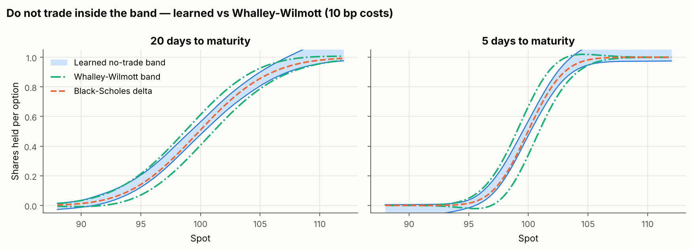
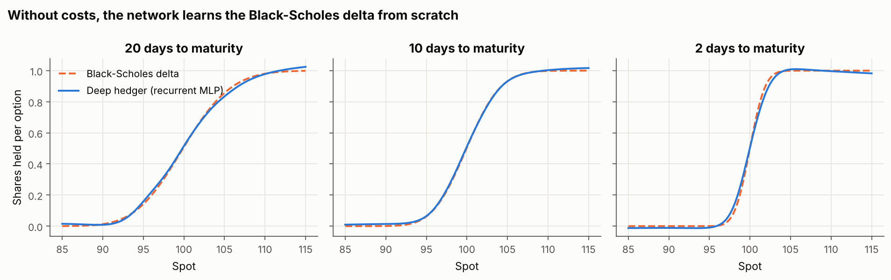
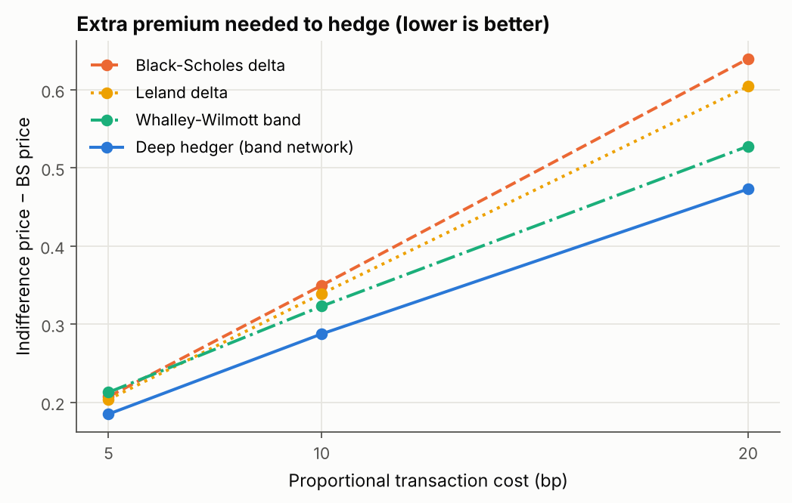
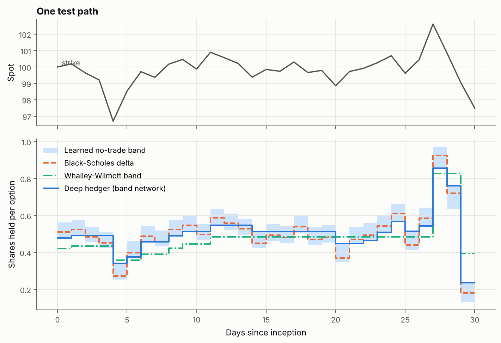
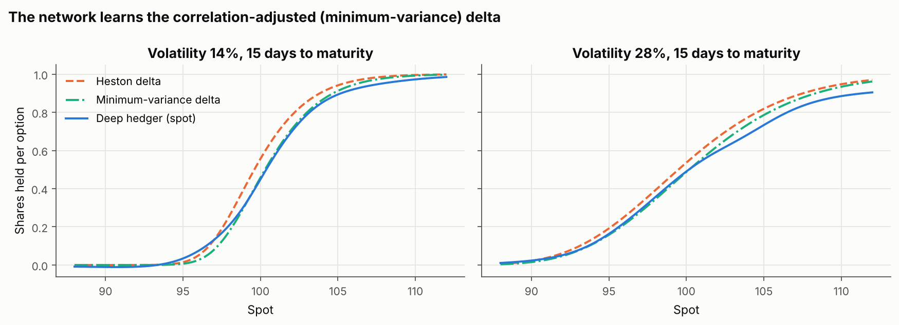
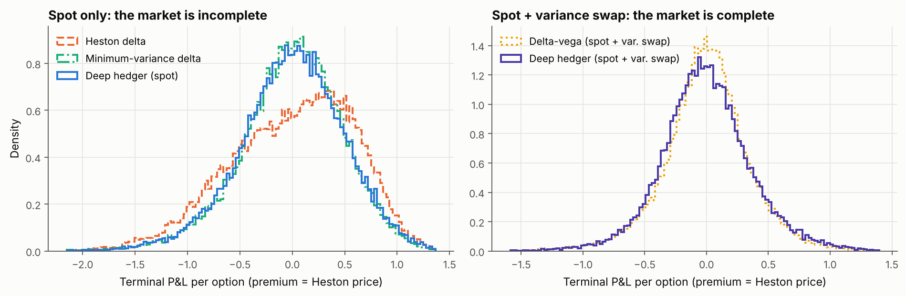

# Deep Hedging under Transaction Costs and Stochastic Volatility


A neural network learns how to hedge a short option position by minimising the
risk of its hedged P&L on simulated paths — with no pricing formula, no Greeks
and no assumption of continuous trading. Implemented from scratch in **NumPy**,
including backpropagation through time, and benchmarked against the classical
answers from the literature.



## Key results

Short 30-day at-the-money call, $S_0 = 100$, daily rebalancing, 131,072
independent test paths.

* **Transaction costs: lower cost of hedging than every classical strategy.**
  With 10 bp proportional costs, the extra premium the hedger must charge on top
  of the Black-Scholes price falls from **0.350** (BS delta) and **0.323**
  (Whalley-Wilmott band) to **0.288**: **−18% vs BS delta, −11% vs
  Whalley-Wilmott**. Transaction costs drop by 30% *and* the 95% CVaR improves
  by 8%. The gain grows with costs: −11%, −18% and −26% vs BS delta at 5, 10
  and 20 bp.
* **No costs: the network rediscovers Black-Scholes.** Trained from scratch, the
  learned hedge sits on average **0.008 shares** from the BS delta and reaches
  the same indifference price (2.355 vs 2.354).
* **Stochastic volatility (Heston): it finds the right hedge, not the textbook
  one.** With the spot as the only instrument, the model's own delta is a poor
  hedge (2.440); the network learns the correlation-adjusted *minimum-variance*
  delta (2.378 vs 2.376) without being told about it. Given a variance swap,
  it matches the model's perfect delta-vega hedge (2.309 vs 2.307).

*Prices are indifference prices under exponential utility (entropic risk,
risk aversion 1): the premium that makes the hedger indifferent to selling the
option. Lower is better. Details in [Methodology](docs/methodology.md).*

## Why this problem

Black-Scholes tells you to hold Δ shares and rebalance continuously, for
free. Real desks rebalance discretely, pay the bid-ask spread on every trade
and face volatility that moves. Each of these breaks the replication argument,
and the classical fixes (Leland's adjusted volatility, Whalley-Wilmott bands,
model deltas) are asymptotic or model-specific. Deep hedging (Buehler, Gonon,
Teichmann & Wood, 2019, developed with J.P. Morgan) turns the question into an
optimisation problem that can be solved for any market simulator, any
instrument set and any frictions.

## What's in the repository

| | |
|---|---|
| **Deep hedger** | Recurrent MLP policy (Buehler et al.) and No-Transaction Band Network (Imaki et al., 2021) |
| **Training** | Entropic risk or CVaR objective, Adam, hand-written backpropagation through time, gradient-checked |
| **Markets** | Black-Scholes; Heston with full-truncation Euler, tradable variance swap |
| **Benchmarks** | BS delta, Leland delta, Whalley-Wilmott band, Heston delta, minimum-variance delta, delta-vega |
| **Pricing** | Heston price, delta and vega by Fourier inversion (Gil-Pelaez, "little Heston trap"), accurate to 1e-5 |
| **Quality** | 21 unit tests (gradient checks, pricing vs quadrature, martingale and convergence tests), CI on GitHub Actions |

## Results

### 1. Sanity check: rediscovering Black-Scholes

Without costs, the optimal hedge is (almost) the BS delta. The network is
never shown the formula.



| Strategy | Mean P&L | Std P&L | CVaR 95% | Turnover | Indifference price |
|---|---:|---:|---:|---:|---:|
| No hedge | -0.019 | 3.478 | 10.172 | 0.00 | 17.103 |
| Black-Scholes delta | 0.000 | 0.357 | 0.828 | 2.71 | **2.354** |
| Deep hedger (recurrent MLP) | 0.000 | 0.366 | 0.801 | 2.70 | 2.355 |

The remaining P&L dispersion is the discretisation error of daily hedging,
which no strategy can remove.

### 2. Transaction costs: learning when not to trade

Under proportional costs, the optimal policy is a **no-trade band**: do nothing
while the hedge is "close enough", otherwise trade back to the edge of the band.
The band network learns its shape directly.

| Cost | BS delta | Leland | Whalley-Wilmott | **Deep hedger** | vs BS delta | vs best classical |
|---:|---:|---:|---:|---:|---:|---:|
| 5 bp | 0.207 | 0.204 | 0.213 | **0.185** | −11% | −9% |
| 10 bp | 0.350 | 0.339 | 0.323 | **0.288** | −18% | −11% |
| 20 bp | 0.640 | 0.604 | 0.528 | **0.473** | −26% | −10% |

*Extra premium over the BS price (indifference price − 2.287) needed to hedge.*



What the network learned, compared with the theory:

* **A band around delta, as theory predicts** (figure at the top). It is
  narrower than Whalley-Wilmott's. A plausible reason: that formula is an
  asymptotic result for continuous monitoring and vanishing costs, while here
  the hedge can only be adjusted once a day, so drifting away from delta is riskier.
* **Fewer trades, lower costs, thinner tails.** At 10 bp it trades 30% less
  than BS delta, pays 30% less in costs, and still has a better CVaR (1.097 vs 1.188).
  Whalley-Wilmott cuts costs further but pays for it in risk (std 0.56 vs 0.44).



Full metrics at 10 bp (all cost levels in [`results/tables`](results/tables/gbm_transaction_costs.md)):

| Strategy | Mean P&L | Std P&L | CVaR 95% | Avg. costs | Turnover | Indifference price |
|---|---:|---:|---:|---:|---:|---:|
| Black-Scholes delta | -0.273 | 0.376 | 1.188 | 0.274 | 2.71 | 2.637 |
| Leland delta | -0.268 | 0.372 | 1.113 | 0.268 | 2.66 | 2.626 |
| Whalley-Wilmott band | -0.165 | 0.562 | 1.334 | 0.166 | 1.63 | 2.610 |
| Deep hedger (band network) | -0.192 | 0.441 | 1.097 | 0.192 | 1.90 | **2.575** |
| Deep hedger (recurrent MLP) | -0.210 | 0.433 | 1.120 | 0.210 | 2.08 | 2.591 |

**Architecture matters.** The band network is within 0.001 of its final risk
after 300 iterations (under a minute on a 2-core CPU); the generic recurrent MLP
is trained for 3,000 iterations and still ends higher (2.591 vs 2.575). Building the known structure of the solution
into the network beats asking it to rediscover that structure.

### 3. Stochastic volatility: Heston

Heston parameters: $\kappa = 1$, $\theta = 0.04$, $\xi = 0.5$, $\rho = -0.7$,
$v_0 = 0.04$. Heston price of the call: 2.237. Evaluated on 32,768 test paths
(the model benchmarks need Fourier pricing at every node).

| Strategy | Instruments | Std P&L | CVaR 95% | Indifference price |
|---|---|---:|---:|---:|
| Black-Scholes delta (σ = 20%) | spot | 0.534 | 1.329 | 2.415 |
| Heston delta | spot | 0.597 | 1.356 | 2.440 |
| Minimum-variance delta | spot | 0.492 | 1.171 | 2.376 |
| Deep hedger | spot | 0.502 | 1.159 | 2.378 |
| Delta-vega | spot + variance swap | 0.355 | 0.842 | **2.307** |
| Deep hedger | spot + variance swap | 0.374 | 0.815 | 2.309 |

* **Spot only (incomplete market).** With $\rho = -0.7$, the spot falls when
  volatility rises, so part of the vega risk can be hedged with the spot. The
  model's delta ignores this and does worse than a naive BS delta. The
  minimum-variance delta $C_S + \rho\xi C_v / S$ corrects for it — and the
  network learns that correction from data alone.
* **Spot + variance swap (complete market).** The network learns to hold the
  variance swap and matches the model's replicating strategy, with a slightly
  better tail.





The learned spot hedge tracks the minimum-variance delta closely where paths
are dense; it drifts in rarely visited regions (high volatility, deep in the
money), where the training set has little to say.

## How it works

1. **Simulate** 131,072 paths of the market (Black-Scholes or Heston).
2. **Hedge** each path with the network: at each date it sees the log-moneyness,
   the time left (and the volatility under Heston) and outputs the position.
3. **Score** the terminal P&L, costs included, with a convex risk measure —
   entropic risk or CVaR. Because both are cash-invariant, the optimal value is
   the indifference price.
4. **Train** by gradient descent on that risk, propagating gradients back
   through the P&L, through the costs and through time.

The band network outputs a band $[\Delta - a,\ \Delta + b]$ around the BS delta
and keeps the previous position clipped into it:
$\delta_t = \mathrm{clip}(\delta_{t-1}, \Delta_t - a_t, \Delta_t + b_t)$.

Full derivations — P&L, risk measures, gradients through time and through the
clip, Leland, Whalley-Wilmott, minimum-variance delta, Fourier pricing — are in
[**docs/methodology.md**](docs/methodology.md).

## Quickstart

From the repository root:

```bash
pip install -e .                              # numpy, scipy, matplotlib
python -m unittest discover -s tests          # 21 tests, ~5 seconds
python experiments/run_all.py --quick         # smoke test of every experiment, ~1 minute
python experiments/run_all.py                 # reproduces all results, ~40 minutes on 2 cores
```

Each experiment also runs on its own (`experiments/gbm_frictionless.py`,
`gbm_transaction_costs.py`, `heston_stochastic_vol.py`). `--quick` writes to
`results/quick/` and never overwrites the published results.

Use it in your own code:

```python
from deephedging import GBM, DeepHedger, EntropicRisk, terminal_pnl
from deephedging.problems import gbm_call_env

T, K, sigma, cost = 30 / 365, 100.0, 0.2, 0.001          # 30-day ATM call, 10 bp costs
market = GBM(sigma=sigma, S0=100.0)
train = gbm_call_env(market.simulate(2**16, T, 30, seed=1), K, sigma, cost)
test = gbm_call_env(market.simulate(2**16, T, 30, seed=2), K, sigma, cost)

hedger = DeepHedger(train.n_features, n_instruments=1, policy="ntb",
                    risk=EntropicRisk(risk_aversion=1.0))
hedger.fit(train, n_iters=300)                            # under a minute

pnl, costs = terminal_pnl(hedger.positions(test), test)
print(f"indifference price: {hedger.risk(pnl):.3f}   average costs: {costs.mean():.3f}")
```

## Repository structure

```
src/deephedging/
  deep_hedger.py    recurrent MLP and no-transaction-band policies, training loop
  nn.py             MLP with hand-written backpropagation, Adam
  hedging.py        hedging environment, P&L with costs and its gradient
  risk.py           entropic risk, CVaR, evaluation metrics
  market.py         Black-Scholes and Heston simulators, variance swap
  pricing.py        BS Greeks, Leland, Whalley-Wilmott, Heston Fourier pricing
  strategies.py     classical benchmark hedges
  problems.py       turns simulated paths into hedging environments
  plotting.py       figure style
experiments/        the three experiments and run_all.py
tests/              unit tests, including finite-difference gradient checks
results/            figures, tables (Markdown), metrics (JSON), trained weights
docs/methodology.md the maths behind every component
```

## Implementation notes

* **No deep-learning framework.** The network, backpropagation through time and
  the optimiser are written in NumPy and verified against finite differences to
  1e-5 relative error. Training runs in float32; tests run in float64.
* **Fair comparison.** Every strategy is scored on the same test paths, with
  the same cost model (including unwinding the hedge at maturity) and the same
  risk measure. The Whalley-Wilmott band uses the same risk aversion as the
  network's objective.
* **Reproducible.** Fixed seeds, independent training and test sets, and every
  number in this README is produced by `experiments/run_all.py` (raw values in
  `results/*.json`).

## Limitations and next steps

* The market is simulated, so results are only as good as the simulator. Natural
  extensions: rough or local-stochastic volatility, jumps, or a generative model
  fitted to historical data.
* One option at a time. A portfolio of options, or options with path-dependent
  payoffs (barriers, Asians), only changes the payoff and the features.
* Costs are proportional. Fixed costs, market impact or a bid-ask spread on the
  variance swap fit in the same framework.

## References

* Buehler, Gonon, Teichmann & Wood (2019). Deep hedging. *Quantitative Finance*.
* Imaki, Imajo, Ito, Minami & Nakagawa (2021). No-transaction band network. arXiv:2103.01775.
* Whalley & Wilmott (1997). An asymptotic analysis of an optimal hedging model for option pricing with transaction costs. *Mathematical Finance*.
* Leland (1985). Option pricing and replication with transactions costs. *Journal of Finance*.
* Heston (1993). A closed-form solution for options with stochastic volatility. *Review of Financial Studies*.

Full list in [docs/methodology.md](docs/methodology.md#references).

## Author

**Antoine Streichenberger** — MSc Financial Engineering, ESILV.
Licensed under the MIT License.
